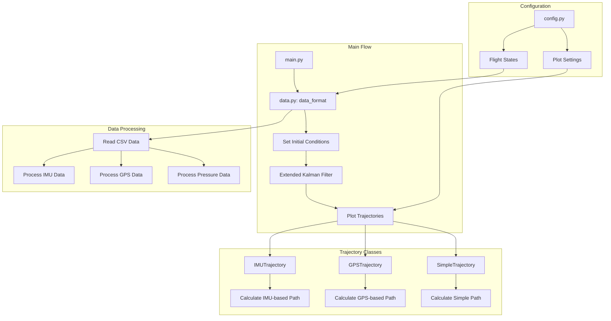

# Flight Path Tracking Project
확장 칼만 필터(EKF)를 이용한 궤적 추정 알고리즘을 구현, 로켓이 비행하는 동안 얻은 IMU, GPS, 기압 센서 데이터를 종합하여 처리하고 비행 궤적을 계산하는 하나로 전자팀 산하 프로젝트입니다.

This project processes and visualizes IMU (Inertial Measurement Unit), GPS, and pressure sensor data from a flight trajectory, implementing various trajectory estimation methods including Extended Kalman Filter (EKF).

## Project Structure

### Core Files
- Main Flow(`main.py`): 
  - Entry point of the application
  - Creates a data_format object
  - Initializes conditions and runs EKF (Extended Kalman Filter)
  - Sets up 3D plotting environment
  - Plots three different trajectory calculations
- Data Processing(`data.py`):
  - `data_format` class: Core data processing class
  - Handles sensor data:
    - Accelerometer
    - Gyroscope
    - Magnetometer
    - GPS coordinates
    - Pressure/Altitude data
  - Implements quaternion-based rotation calculations
    - `quaternion.py`: Quaternion mathematics utilities for 3D rotation calculations
  - Provides methods for initial condition setup and EKF processing
- Trajectory Classes(`plot_trajectory.py`): Implements various trajectory estimation methods:
  - `IMUTrajectory`: Calculates trajectory using IMU data
    - Uses RK4 integration
    - Handles acceleration transformation from body to observer frame
  - `GPSTrajectory`: Processes GPS-based trajectory
    - Uses haversine formula for coordinate conversion
  - `SimpleTrajectory`: Calculates trajectory based on simple velocity integration
    - Inherits from IMUTrajectory
    - Uses gyroscope data for rotation
- Configuration(`config.py`): 
  - Stores global configuration
  - Defines flight states:
    - stand_by
    - launch
    - apogee
    - drogue
    - main
    - touchdown
  - Contains plotting parameters
  - Defines physical constants

### Supporting Files
- `imu.py`: IMU data processing utilities
- `label.py`: Data labeling utilities
- `preprocessing.py`: Data preprocessing functions
- `dsp.py`: Digital signal processing utilities

## Usage
`main.py` 스크립트를 실행하면 IMU, GPS, 그리고 기압 센서 데이터를 기록한 CSV 파일을 처리하여 비행 궤적을 구하고, 다음의 세 가지 방식으로 추정한 경로를 각각 시각화하여 나타냅니다.  
The main script processes data from a CSV file containing IMU, GPS, and pressure sensor readings. It visualizes three different trajectory estimates:
- Kalman filter-based trajectory (red)
- GPS-based trajectory (green)
- Simple integration-based trajectory estimation (blue)

## Dependencies
- pandas
- numpy
- matplotlib
- scipy
